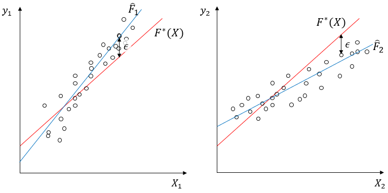
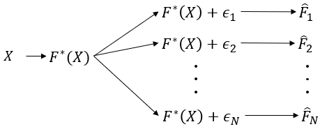
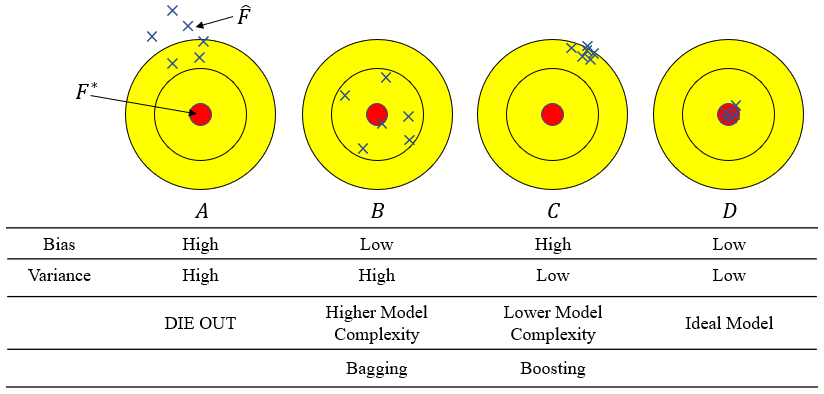
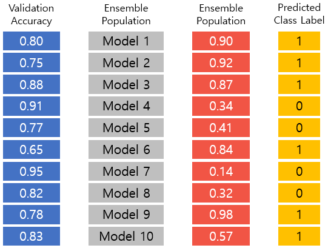
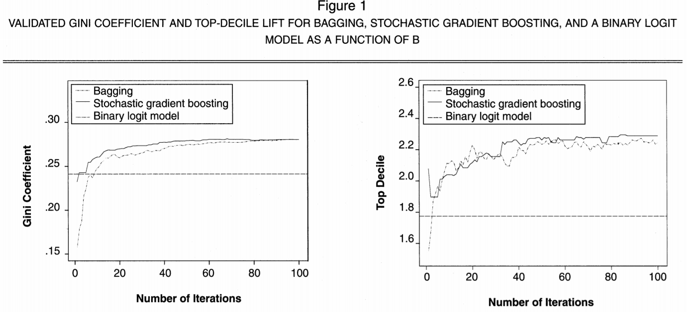

## *“Bagging predictors is a method for generating multiple versions of a predictor and using these to get an aggregated predictor.”* (Breiman 1996)[^1]

해당 포스트는 앙상블 학습의 대표적인 방법 중의 하나인 Bagging에 대해 소개하고 있습니다. 포스트의 내용은 주로 고려대학교 강필성 교수님의 Business Analytics 강의 내용 및 강의 슬라이드와 [Machine Learning Mastery](https://machinelearningmastery.com/bagging-and-random-forest-ensemble-algorithms-for-machine-learning/)라는 블로그 내용을 바탕으로 작성되었습니다. 이외에도 다른 곳에서 참고한 부분은 주석으로 정리해두었습니다. 

<hr>

### 1. Why Bagging? 

여러 Classificaiton 알고리즘 중에서도 Decision Tree는 그 결과를 이해하기 쉽다는 측면 때문에 기계학습을 전공하는 사람들 뿐만 아니라 비전공자들도 애용하는 알고리즘입니다. 그러나 이러한 유용성에도 불구하고 Decision Tree는 한 가지 큰 단점을 가지고 있습니다. 그것은 다른 경쟁 알고리즘 (예. 로지스틱 회귀 분석, LDA)에 비해서 분산값이 높게 나옵니다. 

분산값이 높게 나온다는 것은 쉽게 말하자면, **학습 모델의 input 데이터의 값이 살짝 달라져도 Tree가 매우 다른 모양으로** 만들어지고 이에 따라서 결과적으로 매우 다른 분류 기준이 만들어진다는 뜻입니다. 다른 말로 표현하자면 Decision Tree는 overfitting의 문제가 늘 존재한다고 말할 수 있겠습니다. 

**Bagging 알고리즘**은 Decision Tree처럼 모델의 bias는 낮지만 variance가 높은 분류 알고리즘들의 **variance를 낮추는 방법**입니다.(Bias와 Variance의 개념에 대해서는 2번에서 후술하겠습니다.) 뒤에서 좀더 구체적으로 설명하겠지만 간단하게 말하면, Bootstrap이라는 방법을 통해서 여러 개의 sample을 만들고, 각각의 sample을 이용해서 학습한 결과를 결합시키는 방법입니다. (그래서 **B**oostrap + **Agg**regat**ing** = Bagging입니다.)

본격적으로 Bagging 알고리즘에 대해서 살펴보기 전에 우선 앙상블 학습에 대해서 살펴보고 Bagging 알고리즘을 통해서 얻을 수 있는 효과가 무엇인지 한번 더 짚어보도록 하겠습니다. 

### 2. Ensemble Learning
#### ***Why Ensemble?***

장님 코끼리 만지기라는 우화를 모두들 들어보셨을 겁니다. 각자 자기가 본 것이 전부라고 주장하는 우매함을 꾸짖는 교훈적인 우화인데, 이를 반대로 적용하면 이렇게 말할 수도 있을 겁니다.

> 수많은 장님들이 각각 만진 것들을 모두 합치면 코끼리에 매우 가까운 모양을 추론할 수 있다.

앙상블 학습은 이 명제와 매우 비슷한 intuition을 가지고 있습니다. 그것을 다음의 명제로 정리할 수 있습니다.

> 하나의 알고리즘만 이용하는 것보다, 여러 개의 알고리즘의 결과를 종합할 때 더 나은 Performance를 얻을 수 있다.

아래의 이미지를 보면서 왜 앙상블 학습을 하는 것인지에 대한 이유를 생각해보겠습니다.

강필성 교수님의 강의 슬라이드에서 발췌한 이 그래프는 5개의 서로 다른 알고리즘을 6개의 데이터셋에 적용했을 때, 그 performance가 어떻게 되는 지를 보여주고 있습니다. 그래프의 모양을 보시면 모든 데이터셋에서 우월한 performance를 보이는 알고리즘은 존재하지 않는다는 것을 확인할 수 있습니다. 이는 연구자나 현업에 계신 분들에게 다음과 같은 질문을 던져줍니다. 

> 내가 가진 데이터셋에는 어떤 알고리즘이 최적의 알고리즘일까?

하지만 나의 데이터셋에 맞는 알고리즘을 찾기 위해서 일일이 trial & error를 해보는 것은 굉장히 부담스러운 일일 겁니다.

이러한 고민에 대한 대답은 다음의 그래프를 통해서 확인할 수 있습니다.

위 이미지에서 각각의 그래프는 5개의 알고리즘의 결과를 결합하였을 때(앙상블 학습)의 결과를 보여주고 있습니다. 어떻게 결합했느냐에 따라서 약간의 차이는 존재할 수 있지만, 한 가지 확실한 것은 4가지 결합 방식의 결과 모두가 개별적인 알고리즘으로 학습했을 때보다 더 좋은 performance를 보였는 사실입니다. 이를 통해서 우리는 경험적으로 앙상블 학습을 했을 때 개별 알고리즘 보다 더 좋은 performance를 낼 수 있다는 것을 확인할 수 있습니다. 따라서 위의 질문에 대해서는 다음과 같은 답을 내릴 수 있습니다. 

> 뭐가 최적인지 모르겠다면, 일단은 Ensemble!

#### ***Then, why does Ensemble work well?***
#### ***Bias & Variance***
Ensenble 학습이 왜 단일 알고리즘보다 더 좋은 performance를 보여주냐는 질문에 답하기 위해서 우선, Bias와 Variance의 개념부터 짚어 보겠습니다.
현실에서 데이터가 어떻게 생성되는 지를 아래의 식으로 표현해 보겠습니다. <br>

<div style="text-align:center"> $$ y={ F }^{ * }(X)+\epsilon ,\quad \epsilon \sim N(0,{ \sigma  }^{ 2 }) $$ </div>

여기에서 $${ F }^{ * }(X)$$는 input값이 주어졌을 때 y값을 생성하는 기저 함수라고 생각하겠습니다. 연구자가 학습을 통해서 알고자 하는 타겟이 바로 $${ F }^{ * }(X)$$입니다. 이 함수는 데이터가 생성되는 매커니즘을 완벽하게 구현하고 있으나, 이슈가 되는 것은 $$\epsilon$$입니다. 아무리 기저함수를 완벽하게 알고 있다고 하더라도 $$\epsilon$$로 표현되는 데이터 생성과정의 노이즈까지 완벽하게 잡아낼 수는 없습니다. 그러면 아래의 이미지와 같은 일이 일어나게 됩니다.

위의 가정에 따라서 $${ F }^{ * }(X)$$라는 기저 함수에 노이즈를 포함해서 2개의 데이터($$({ X }_{ 1 },{ y }_{ 1 })$$, $$({ X }_{ 2 },{ y }_{ 2 })$$)를 만들었습니다. 만약에 빨간 선으로 표시된 원래의 기저함수를 지운 상태에서 데이터 포인트만 주고 이 두 데이터를 설명할 수 있는 함수를 찾아보라고 하면, 동일한 기저함수에서 생성되었음에도 불구하고 두 데이터를 이용해서 찾은 함수가 같지 않을 것입니다. 정리하면 동일한 매커니즘의 기저함수로 데이터를 생성해도 노이즈가 다르게 발생할 수 있기 때문에, 데이터를 이용해서 찾은 함수식이 달라질 수 있습니다.


위의 이미지에서 추정한 여러 함수값($$\hat { F } $$)들의 평균을 다음과 같이 $$\bar { F } (X)$$라고 정의하겠습니다.<br>
<div style="text-align:center">$$ \bar { F } (X)=E\left[ { \hat { F }  }_{ D }(X) \right]  $$</div>

그 때, 어떤 $${ X }_{ 0 }$$라는 데이터에 대해서 정답(true y)과 추정된 y값($$\hat { F } (X)$$) 사이의 차이를 계산해 보면 아래와 같이 정리할 수 있습니다.
$$ Err({ X }_{ 0 })=E{ \left[ y-\hat { F } (X)|X={ X }_{ 0 } \right]  }^{ 2 } $$ <br>
&nbsp;&nbsp;&nbsp;&nbsp;&nbsp;&nbsp;&nbsp;&nbsp;&nbsp;&nbsp;&nbsp;&nbsp;&nbsp;&nbsp;&nbsp;&nbsp;&nbsp; $$=E{ \left[ { F }^{ * }({ X }_{ 0 })+\epsilon -\hat { F } ({ X }_{ 0 }) \right]  }^{ 2 }  $$ <br>
&nbsp;&nbsp;&nbsp;&nbsp;&nbsp;&nbsp;&nbsp;&nbsp;&nbsp;&nbsp;&nbsp;&nbsp;&nbsp;&nbsp;&nbsp;&nbsp;&nbsp; $$=E{ \left[ { F }^{ * }({ X }_{ 0 })-\hat { F } ({ X }_{ 0 }) \right]  }^{ 2 }+{ \sigma  }^{ 2 }  $$ <br>
&nbsp;&nbsp;&nbsp;&nbsp;&nbsp;&nbsp;&nbsp;&nbsp;&nbsp;&nbsp;&nbsp;&nbsp;&nbsp;&nbsp;&nbsp;&nbsp;&nbsp; $$=E{ \left[ { F }^{ * }({ X }_{ 0 })-\bar { F } \left( { X }_{ 0 } \right) +\bar { F } \left( { X }_{ 0 } \right) -\hat { F } ({ X }_{ 0 }) \right]  }^{ 2 }+{ \sigma  }^{ 2 }  $$ <br>
&nbsp;&nbsp;&nbsp;&nbsp;&nbsp;&nbsp;&nbsp;&nbsp;&nbsp;&nbsp;&nbsp;&nbsp;&nbsp;&nbsp;&nbsp;&nbsp;&nbsp; $$=E{ \left[ { F }^{ * }({ X }_{ 0 })-\bar { F } \left( { X }_{ 0 } \right)  \right]  }^{ 2 }+E{ \left[ \bar { F } \left( { X }_{ 0 } \right) -\hat { F } ({ X }_{ 0 }) \right]  }^{ 2 }+{ \sigma  }^{ 2 }  $$ <br>
&nbsp;&nbsp;&nbsp;&nbsp;&nbsp;&nbsp;&nbsp;&nbsp;&nbsp;&nbsp;&nbsp;&nbsp;&nbsp;&nbsp;&nbsp;&nbsp;&nbsp;&nbsp;&nbsp; ($$ \because 2E\left[ { F }^{ * }({ X }_{ 0 })-\bar { F } ({ X }_{ 0 }) \right] \cdot E\left[ \bar { F } ({ X }_{ 0 })-\hat { F } ({ X }_{ 0 }) \right] =0 $$) <br>
&nbsp;&nbsp;&nbsp;&nbsp;&nbsp;&nbsp;&nbsp;&nbsp;&nbsp;&nbsp;&nbsp;&nbsp;&nbsp;&nbsp;&nbsp;&nbsp;&nbsp; $$={ \left[ { F }^{ * }({ X }_{ 0 })-\bar { F } \left( { X }_{ 0 } \right)  \right]  }^{ 2 }+E{ \left[ \bar { F } \left( { X }_{ 0 } \right) -\hat { F } ({ X }_{ 0 }) \right]  }^{ 2 }+{ \sigma  }^{ 2 } $$

위에 식으로 정리된 내용을 말로 정리해 보자면, 실제 데이터 포인트에서 실제값과 추정값 간의 차이($$Err({ X }_{ 0 })$$)는 다음의 세 부분으로 분해가 됩니다.
* Original 기저함수를 이용해서 만든 값($${ F }^{ * }({ X }_{ 0 })$$)과 반복적으로 추정을 했을 때의 평균값($$\bar { F } ({ X }_{ 0 })$$) 사이의 차이(Bias)의 제곱
* 반복해서 추정했을 때의 평균값($$\bar { F } ({ X }_{ 0 })$$)과 개별적인 추정치들($$\hat { F } ({ X }_{ 0 })$$) 사이의 차이의 제곱(Variance)
* 자연발생적인 변동성

$$  { Bias }^{ 2 }(\hat { F } ({ X }_{ 0 }))+Var(\hat { F } ({ X }_{ 0 }))+{ \sigma  }^{ 2 }  $$

#### ***Bagging & Boosting***

Bias와 Variance에 대한 내용을 이미지화 하면 다음과 같이 표현할 수 있습니다. A는 Bias와 Variance가 모두 높은 상태이므로 도태될 것이고, D는 우리가 원하는 이상적 형태의 학습 결과입니다. 실제 단일 알고리즘을 이용해서 학습을 한 결과는 B나 C 둘 중에 하나일 것입니다. <br>
B의 경우 Bias는 낮으나 Variance는 높은, 즉 input 값의 변화에 따라서 함수값의 변동이 큰 과적합의 경향이 나타나는 학습 결과를 보여주고 있습니다. 이는 주로 복잡도가 높은 알고리즘으로 학습했을 때(예. Full Tree) 나타나는 결과입니다. C의 경우에는 Bias는 높으나 Variance는 높습니다. <br>
B의 경우를 D와 같이 바꾸기 위해서 쓰는 학습 방법이 Bagging이고, C의 경우를 D와 같이 바꾸기 위해서 사용하는 학습 방법이 Boosting입니다.

#### ***Answer to "Why Ensemble works well"***
이제 개념들을 정리했으니, 원래의 질문에 대한 수학적 답변을 내려보겠습니다.
$$ { y }_{ m }=f(X)+{ \epsilon  }_{ m }(X) $$
$${ y }_{ m }$$은 m이라는 개별 모델에서 만들어진 값입니다. 그리고 개별 모델 m은 앙상블을 구성하는 M개의 모델 중 하나입니다. 이 때 개별 모델 m의  error를 $${ \epsilon  }_{ m }(X)$$이라고 하면, $${ y }_{ m }$$와 $$f(X)$$의 차이(error)를 제곱한 것의 기대값은 아래와 같이 쓸 수 있습니다. <br>

$$ { E }_{ X }\left[ { \left\{ { y }_{ m }(X)-f(X) \right\}  }^{ 2 } \right] ={ E }_{ X }\left[ { { \epsilon  }_{ m }(X) }^{ 2 } \right]    $$ 

만일 앙상블을 구성하는 전체 M개의 모델의 error의 제곱의 기대값의 평균을 구한다면(앙상블 학습은 하지 않고 각각으로 학습한 다음에 구한 평균값) 다음과 같은 식으로 정리할 수 있습니다. <br>
<div style="text-align:center">$$ { E }_{ Avg }=\frac { 1 }{ M } \sum _{ m=1 }^{ M }{ { E }_{ X }[{ \epsilon  }_{ m }{ (X) }^{ 2 }] } $$</div>

그러나 앙상블 학습을 통해서 얻어지는 기대 error값의 제곱은 다음과 같습니다. <br>
$$  { E }_{ Ensemble }={ E }_{ X }\left[ { \left\{ \frac { 1 }{ M } \sum _{ m=1 }^{ M }{ ({ y }_{ m }(X)-f(X)) }  \right\}  }^{ 2 } \right]={ E }_{ X }\left[ \frac { 1 }{ { M }^{ 2 } } { \left\{ \sum _{ m=1 }^{ M }{ { \epsilon  }_{ m } } (X) \right\}  }^{ 2 } \right] $$ <br>
$$={ E }_{ X }\left[ \frac { 1 }{ { M }^{ 2 } } \left\{ { { \epsilon  }_{ 1 } }^{ 2 }(X)+{ { \epsilon  }_{ 2 } }^{ 2 }(X)+\cdots +{ { \epsilon  }_{ M } }^{ 2 }(X)+2\sum _{ i=1 }^{ M }{ \sum _{ j\neq i }^{ M }{ { \epsilon  }_{ i }(X){ \epsilon  }_{ j }(X) }  }  \right\}  \right]    $$

여기에서 다음의 두 가정을 추가해보겠습니다. 
> $$  { E }_{ X }\left[ { \epsilon  }_{ m }(X) \right] =0  $$ <br>
> $$  { E }_{ X }\left[ { \epsilon  }_{ m }(X){ \epsilon  }_{ l }(X) \right] =0\quad (m\neq l)  $$ <br>

두 가정이 만족될 경우 M개의 모델의 error의 제곱의 기대값의 평균($${ E }_{ Avg }$$)과 앙상블 학습에서의 기대되는 error의 제곱의 값($${ E }_{ Ensemble }$$)의 관계는 다음과 같은 식으로 표현됩니다.<br>
<div style="text-align:center">$$  { E }_{ Ensemble }=\frac { 1 }{ M } { E }_{ Avg }   $$ </div>
여기서 앙상블의 error는 개별 error의 평균값의 1/M입니다. 물론 이 관계식은 위의 가정, 특히 error 같의 상관관계가 없다는 매우 강한 가정을 만족할 때 성립됩니다. (모델들이 모두 독립이라는 것은 있을 수 없는 일이겠지요.)
그러나 이를 통해서 우리는 **이상적인 조건 하에서 앙상블을 통해서 error를 1/M로 줄일 수 있다**는 것을 확인할 수 있습니다.

위의 설명이 앙상을을 통한 성능 향상의 상한을 보여주었다면, 앙상블을 통한 성능 향상의 하한은 어디일까요? 각각의 모델들의 error의 합의 제곱은 코시 부등식에 따라서 다음과 같이 표현할 수 있습니다.

<div style="text-align:center">$$  { \left[ \sum _{ m=1 }^{ M }{ { \epsilon  }_{ m } } (X) \right]  }^{ 2 }\le M\sum _{ m=1 }^{ M }{ { { \epsilon  }_{ m }(X) }^{ 2 } }$$ </div>

위 식의 양변을 $$\frac { 1 }{ { M }^{ 2 } } $$로 나누면 다음의 부등식이 성립합니다.
<div style="text-align:center">$${ \left[ \frac { 1 }{ M } \sum _{ m=1 }^{ M }{ { \epsilon  }_{ m }(X) }  \right]  }^{ 2 }\le \frac { 1 }{ M } \sum _{ m=1 }^{ M }{ { { \epsilon  }_{ m }(X) }^{ 2 } }   $$ </div>
이 때 좌변은 $${ E }_{ Ensemble }$$을, 우변은 $${ E }_{ Avg }$$를 나타냅니다. <br>
<div style="text-align:center">$$  { E }_{ Ensemble }\le { E }_{ Avg }  $$</div>

위의 결론을 통해서 앙상블 학습을 하면 **최악의 경우라고 하더라도 개별 모델들의 error의 평균보다는 더 낮은 error를 갖는 학습 결과를 얻을 수 있다**는 것을 확인할 수 있습니다. 

### 3. Issues in Bagging

본격적으로 Bagging에 대해서 논하기 전에, 먼저 Leon Breiman 교수님이 본인의 1996년 Machine Learning 저널에서 쓴 Bagging에 대한 정의(제가 이 포스트 맨 위에 쓴 영어 문장)를 살펴보겠습니다.

> ***"Bagging은 여러 버전의 예측기(predictor)를 생성하고 이 예측기들을 결합한 예측기(an aggregated predictor)를 이용하기 위한 방법이다."***

이 정의를 살펴보는 이유는 이 정의가 Bagging과 관련된 중요한 이슈 2가지를 잘 담고 있기 때문입니다. 그 이슈들을 다음과 같습니다.

1. 앙상블 의 개별 구성요소인 base classifier의 다양성을 어떻게 확보할까? (어떻게 ***다양한*** 예측기를 생성할 것인가?)
1. 개별 분류기의 결과물을 어떻게 통합할 것인가? (이 예측기들을 ***어떻게 결합***할 것인가?)

이를 그림으로 표현하자면 다음과 같이 표현할 수 있을 것입니다.

위 그림에서 윗 부분에 있는 빨간 점선 안의 부분은 첫번째 이슈인 base classifier의 다양성 확보의 문제를 담고 있습니다. 만약, 각각의 Subset 간의 correlation이 크다면 다양성을 확보할 수가 없을 것입니다. 따라서 Subset의 개별성을 확보할 수 있는 systematic sampling method가 매우 중요하다고 할 수 있습니다. Bootstrap이라는 samping 방법을 사용하기 전, 가능 단순한  방법은 "*K-fold data split*"이었습니다. 이 방법에 대해서는 아래에서 설명하도록 하겠습니다.

아랫 부분의 빨간 점선 안의 부분은 두번째 이슈인 결과물의 통합에 대한 문제를 담고 있습니다. 이 결합 방법은 단순한 평균부터, 가중 평균 등 다양한 방법이 존재합니다. 

두 개의 빨간 점선 박스 가운데에 위치한 model 부분에는 어떤 supervied learning algorithm이라도 사용할 수 있기 때문에 따로 특별한 표시를 해두지는 않았습니다. 다만 여기서 주의할 점은 bagging을 통해서 performance를 높이기 위해서는 Logistic regression, LDA과 같이 Bias가 큰 알고리즘 보다는 Decision Tree, SVM과 같이 Bias는 낮고 Variance가 큰 알고리즘을 사용하여야 합니다.

### 4. K-fold Data Split

K-fold data split은 전체 Dataset을 k개의 블록으로 나눈 다음에, 각각의 base classifier에서는 "k-1"개의 subset만을 학습하는 방법을 일컫습니다. 아래 이미지를 통해 K-fold data split이 어떻게 이루어지는 지를 한번 더 확인해 보겠습니다.


K-fold data split은 우선 전체 Dataset을 랜덤으로 K개의 블록으로 나누는 것부터 시작합니다. 위 다이어그램에서 X(n)은 K개의 블록 중 n번째 블록의 독립변수를 뜻하고 y(n)은 n번째 블록의 종속변수를 뜻합니다. 이렇게 K개로 나눈 블록을 각각 "K-1"개씩 학습을 하게 됩니다.

다이어그램의 오른편의 가장 위를 보면 $$f_1$$ 학습기가 있습니다. 이 $$f_1$$ 학습기는 'K'번째 블록을 제외한 "K-1"개의 블록에 대해서 학습을 진행합니다. $$f_2$$ 학습기는 'K-1'번째 블록을 제외한 "K-1"개의 블록에 대해서 학습을 진행합니다. 같은 방식으로 $$f_3$$ 학습기는 'K-2'번째 블록을 제외한 "K-1"개의 블록에 대해서 학습을 진행합니다. 이런 방식으로 학습을 진행하면 총 "K"개의 학습기에 대해서 학습이 진행되게 됩니다.

이런 학습 방식에서 $$f_1$$ 학습기와 $$f_2$$ 학습기는 "K-2"개의 블록을 공유하게 됩니다. $$f_2$$ 학습기와 $$f_3$$ 학습기 또한 "K-2"의 블록을 공유합니다. 이처럼 개별 base classifier 간의 높은 상관관계 때문에, K-fold data split의 방법으로는 충분한 **다양성**을 확보하는 데에 제약이 존재합니다.

### 5. Bootstraping Aggregation (Bagging)

그렇다면, 우리의 논의에 중심에 있는 Bagging은 어떻게 **다양성**을 확보할 수 있을까요. 그 해답은 Bootstrap이라는 샘플링 방식으로부터 옵니다.

#### ***Bootstrap Method***

Bootstrapping은 중복을 허용한 샘플링으로부터 얻어낸 테스트값이나 통계량을 지칭합니다. 기계학습의 맥락에서는 중복을 허용하는 랜덤 샘플링을 통해서 데이터셋의 사이즈를 늘리는 방법을 가리켜 Bootstrapping이라고 합니다. 

Bootstrapping은 데이터셋(training set) 내의 데이터 분포가 고르지 않은 경우에 사용됩니다. 사과와 오렌지를 구분하는 classifier를 트레이닝한다고 가정해보겠습니다. Training set에 사과 이미지 1만장과 오렌지 이미지 100장이 포함되어 있다면, 항상 사과만 찍는 멍청한 classifier도 99%의 트레이닝 정확도를 보일 것입니다. 이렇게 균형이 맞지 않은 상황에서는 데이터가 적은 클래스의 error는 무시되는 방향으로 트레이닝되기 쉽습니다. Bootstrapping을 이용하면 중복을 허용해서 랜덤 샘플링을 하기 때문에 원래 데이터셋이 가지고 있었던 불균형을 해소하는 데에 도움을 줄 수 있습니다.[^2]

다른 예를 통해서 Bootstrap이 실제로 어떻게 진행되는 지 확인해보겠습니다. 우리에게 1000개의 숫자값이 있는 모집단에서 100개의 숫자값(X라고 하겠습니다)이 들어있는 샘플을 뽑았다고 가정해보겠습니다. 그리고 이 숫자들을 이용해서 모집단의 평균을 구하고자 합니다. <br>
물론 모집단의 평균을 다음과 같은 식으로 계산할 수도 있습니다:

$$ mean_X = \frac{1}{100}\sum_{i=1}^{100}x_{i} $$

그러나 조금만 생각해봐도 이 방식의 연산은 샘플이 가지고 있는 오류를 그대로 담고 있다는 것을 알고 있습니다. Bootstrap을 이용하면 다음과 같은 방식으로 모집단의 평균을 연산하게 됩니다:

1. 가지고 있는 샘플 중, 중복을 허용하여서 많은 숫자의 sub-sample(예. 1000개의 sub-sample)을 추출합니다.
1. 각 sub-sample의 평균값을 계산합니다.
1. sum-sample의 평균값들의 평균을 계산합니다. 그리고 이 평균값이 모집단 평균의 추정치가 됩니다.

#### ***Bootstrapping for Bagging***
Bagging 알고리즘을 적용하기 위한 Bootstrapping은 다음과 같이 이루어집니다.


Bootstrapping에서 핵심은 Bootstrap이라는 Orignal Dataset에서 뽑은 샘플을 만드는 데에 있습니다. 만일 Original Data에 N개의 관찰값이 존재한다면, 그 N개의 관찰값 중 중복을 허용하여서 다시 N개의 값을 뽑아서 하나의 Bootstrap을 만듭니다. 위의 이미지를 보면, Original Dataset에 10개의 관찰값이 존재합니다. 중복을 허용하여서 랜덤 샘플링을 하면 Bootstrap 1, Bootstrap 2, ... , Bootstrap B (총 B개의 Bootstrap을 만든다고 가정할 때)을 만들 수 있습니다. 그리고 각각의 Bootstrap에는 Original Dataset과는 다르게 같은 관찰값이 여러 번 나온다는 것을 확인할 수 있습니다.

#### ***Result Aggregating***

앞에서 설명한 대로 B개의 Bootstrap을 만들고 나면, Model complexity가 높은(Low Bias & High Variance) base classifier를 통해 학습을 하게 됩니다. 그 이후에는 base classifier를 통해서 학습한 결과를 어떻게 결합할 것인지의 문제가 남아 있습니다. 

결과값을 결합하는 방법에는 여러 가지가 있지만, 여기에서는 아래 이미지에 나온 학습결과를 어떻게 결합하는 지를 3가지 결합방식의 예를 들어서 설명하겠습니다.

이미지에서 파란색 칼럼은 각각의 모델이 validation 관점에서 이전에 얼마나 정확했는 지에 대한 수치를 보여줍니다. 주황식 칼럼은 새로운 테스트 데이터가 들어왔을 때, 1 또는 0의 binary classification의 경우, 1의 범주의 속할 확률을 보여줍니다. 예를 들어 Model 1은 1일 확률을 90%라고 하고 Model 2는 92%라고 하고 있습니다. 

* Majority Voting 

$$ { \hat { y }  }_{ Ensemble }=arg\max _{ i }{ (\sum _{ j=1 }^{ n }{ \delta ({ \hat { y }  }_{ j }=i) } ,\ i\ \in \ \{ 0,\ 1\} ) } $$ 

 Majority Voting은 1로 분류한 것과 0으로 분류한 것의 수를 각각 센 다음, 다수의 범주로 할당해주는 결합방식입니다. 위의 예의 경우 6개의 모델이 1로 분류했고, 4개의 모델이 0으로 분류했기 때문에 Vajority Voting에 따라서 해당 데이터를 1로 할당하게 됩니다.

<div style="text-align:center">$$\sum _{ j=1 }^{ n }{ \delta ({ \hat { y }  }_{ j }=\ 1)\ =\ 6 }$$
$$\sum _{ j=1 }^{ n }{ \delta ({ \hat { y }  }_{ j }=\ 0)\ =\ 4 }$$
$$ \therefore { \hat { y }  }_{ Ensemble }\ =\ 1 $$ </div>

* Weighted Voting (weight: validation accuracy of individual models)

<div style="text-align:center">$$ { \hat { y }  }_{ Ensemble }\ =\ arg\max _{ i }{ \left( \frac { \sum _{ j=1 }^{ n }{ \left( { ValiAcc }_{ j } \right) \cdot \delta \left( { \hat { y }  }_{ j }=\ i \right)  }  }{ \sum _{ j=1 }^{ n }{ \left( { ValiAcc }_{ j } \right)  }  } ,\ i\ \in \ \{ 0,\ 1\}  \right)  }   $$ </div>

Weighted Voting 중 validation accuracy를 weight로 활용하는 방법은, 이전에 개별 모델이 보여주었던 정확성을 라벨링에 활용하는 방식입니다. 위의 예에서 Model 2는 vaidation accuracy가 0.75이고 Model 7은 validation accuracy가 0.95입니다. Majority Voting 방식으로 라벨링을 한다면, Model 2와 Model 7의 결과값에 같은 비중을 준다는 것인데, 이는 validation accuracy를 고려할 때 문제가 있는 방식일 겁니다.
Validation accuracy를 weight로 고려하면, 새로운 데이터를 0으로 할당한 경우의 voting 값은 0.424, 1로 할당한 경우의 voting 값은 0.576입니다. 이에 따라서 새로운 데이터를 1로 할당할 수 있을 것입니다.

<div style="text-align:center">$$ \frac { \sum _{ j=1 }^{ n }{ \left( { ValiAcc }_{ j } \right) \cdot \delta \left( { \hat { y }  }_{ j }=\ 0 \right)  }  }{ \sum _{ j=1 }^{ n }{ \left( { ValiAcc }_{ j } \right)  }  } =0.424  $$
$$  \frac { \sum _{ j=1 }^{ n }{ \left( { ValiAcc }_{ j } \right) \cdot \delta \left( { \hat { y }  }_{ j }=\ 1 \right)  }  }{ \sum _{ j=1 }^{ n }{ \left( { ValiAcc }_{ j } \right)  }  } =0.576 $$
$$ \therefore { \hat { y }  }_{ Ensemble }\ =\ 1 $$</div>

* Weighted Voting (weight: predicted probability of each class)

$$ { \hat { y }  }_{ Ensemble }=arg\max _{ i }{ \left( \frac { 1 }{ n } \sum _{ j=1 }^{ n }{ P\left( { y }_{ j }=1 \right)  } ,i\in \{ 0,\ 1\}  \right)  }   $$

Validation accuracy 말고도 각 모델에서의 예측 cofindence를 weight로 사용할 수도 있습니다. 위의 예의 경우 주황색 칼럼의 수치를 예측 confidence로 사용할 수 있습니다. 이 방식을 따르면 0으로 할당하는 것의 voting값은 0.375, 1로 할당하는 것의 voting값은 0.625입니다. 이에 따라 최종적으로 새로운 데이터를 1로 할당할 수 있습니다. 

<div style="text-align:center">$$ \sum _{ j=1 }^{ n }{ P\left( { y }_{ j }=0 \right)  } =0.375  $$
$$ \sum _{ j=1 }^{ n }{ P\left( { y }_{ j }=1 \right)  } =0.625  $$
$$ \therefore { \hat { y }  }_{ Ensemble }\ =\ 1 $$ </div>

<hr>
### Example of Bagging in Marketing Research[^3]
Bagging은 기계 학습 분야의 연구 뿐만 아니라 다른 영역의 연구에서도 사용되고 있습니다. 그 예로 전형적인 마케팅 논문에서 Bagging을 어떻게 이용하는 지를 살펴보겠습니다. 2006년 Journal of Marketing Resarch라는 마케팅 분야의 탑저널에 실린 "Bagging and Boosting Classification Trees to Predict Churn"이라는 논문을 보면, 기존의 마케팅 연구에서 가장 많이 사용하는 Binary Logit과 비교했을 때, 서비스 이탈 고객을 예측하는 데에 있어서 Bagging과 Stochastic Gradient Boosting 방식이 얼마나 performance가 더 좋은 지 잘 보여주고 있습니다.
아래 이미지는 3개의 알고리즘을 이용한 분류 결과를 그래프롤 통해서 보여주고 있습니다.

Iteration 값이 증가함에 따라 bagging과 stochastic gradient boosting 모델 모두, gini coefficient와 top decile lift의 관점에서 벤치마크가 되는 binary logit 모델 보다 더 좋은 성능을 보이는 것을 확인할 수 있습니다.

<hr>
### Bagging using Python Code

```python
def func(x):
    print('hello, world')
    print('this is a really long statements, this is a really long statementsi, this is a really long statements')
```

<hr>

##### Appendix: How Bagging works better?[^4]
어떻게 Bagging이 예측력을 크게 향상시킬 수 있을까요. 주어진 훈련자료 $$L $$($$L={ ({ x }_{ i },{ y }_{ i }) }_{ i=1 }^{ n }$$)을 이용하여 구축된 예측모형 $$\hat { f } (x)$$는 $$L $$에 의존합니다. 이를 강조하기 위해서 $$\hat { f } (x)=f(x,L )$$라고 쓰겠습니다.<br>
그리고 주어진 예측모형 $$f(x,L )$$에 대하여 평균예측모형  $${f}_{ Avg }(x)$$를 $${ f }_{ Avg }(x)={ E }_{ L  }f(x, L )$$이라고 정의하겠습니다. 여기서 기댓값은 훈련자료가 얻어진 **모집단의 분포**를 이용하여 구한다는 점에 유의해야 합니다. 다음의 증명은 평균예측모형의 기대손실이 단일 예측모형의 기대손실보다 항상 작다는 것을 보여줍니다.<br>
$$(X,y)$$를 $$L$$과 독립인 미래의 관측 값이라고 하겠습니다. 이때 제곱손실함수 $$L(y,a)={ (y-a) }^{ 2 }$$에 대하여 $$f(x,L)$$과 $${ f }_{ Avg }(x)$$의 기대손실 $$R$$와 $${ R }_{ Avg }$$를 다음과 같이 정의할 수 있습니다.<br>

<div style="text-align:center">$$R={ E }_{ (X,y) }{ E }_{ L }L(y,f(x,L))$$
$${ R }_{ Avg }={ E }_{ (X,y) }L(y,{ f }_{ Avg }(x))$$</div>

제곱함수는 볼록함수이므로 Jensen의 부등식에 의하여 다음의 관계식이 성립합니다.<br>
<div style="text-align:center">$${ E }_{ (X,y) }{ E }_{ L }{ f }^{ 2 }(X,L)\ge { E }_{ (X,y) }{ f }_{ Avg }{ (X) }^{ 2 }$$</div>

따라서, 
$$ R={ E }_{ (X,y) }\left[ { y }^{ 2 } \right] -2{ E }_{ (X,y) }\left[ y\cdot { E }_{ L }f(X,L) \right] +{ E }_{ (X,y) }{ E }_{ L }\left[ { f }^{ 2 }(x,L) \right]   $$ <br>
&nbsp;&nbsp;&nbsp;&nbsp;$$  \ge E_{ (X,y) }\left[ { y }^{ 2 } \right] -2{ E }_{ (x,y) }[y\cdot { f }_{ Avg }(X)]+{ E }_{ (X,y) }[{ f }_{ Avg }{ (X) }^{ 2 }] $$ <br>
&nbsp;&nbsp;&nbsp;&nbsp;$$=E_{ (x,y) }[{ (y-{ f }_{ Avg }(X)) }^{ 2 }]={ R }_{ Avg } $$

위의 증명에서 알 수 있는 한 가지는 $$ R-{ R }_{ Avg } $$를 다음의 식으로 정리할 수 있다는 것입니다.
<div style="text-align:center">$$ E_{ (X,y) }\left\{ { E }_{ L }{ f }^{ 2 }(X,L)-{ ({ E }_{ L }f(X,L) }^{ 2 } \right\} =E_{ (X,y) }({ Var }_{ L }f(X,L)) $$</div>

다시 말하자면 $$f(X,L)$$의 분산이 크면 평균예측모형이 원래의 예측모형을 크게 향상시키며, 반대로 분산이 작으면 평균예측모형의 예측력의 향상 정도가 줄어 듭니다. <br>
그런데, 훈련자료를 얻은 모집단의 분포를 모르기 때문에 실제문제에서는 평균예측모형을 구할 수 없습니다. 그 대신 학습 자료를 모집단으로 생각하고 이로부터 평균예측모형을 구한 것이 바로 Bagging을 이용한 예측모형이라 할 수 있습니다. <br>
Bagging은 결국 주어진 예측모형의 평균예측모형을 구하는 것이고 이를 통하여 분산을 줄여줌으로써 예측력을 향상시킵니다. 바꿔 말하면 Bagging은 예측모형의 Bias에는 영향을 미치지 않고 분산에만 영향을 미친다. 따라서 배깅을 적용하기에 적합한 예측모형은 Bias가 없고 분산이 큰 모형입니다. 

<hr>

##### Footnotes:

[^1]: Breiman, Leo (1996). "Bagging predictors". Machine Learning. 24(2): 123–140.
[^2]: [Learning Carrot 블로그](https://learningcarrot.wordpress.com/2015/11/12/%EB%B6%80%ED%8A%B8%EC%8A%A4%ED%8A%B8%EB%9E%A9%EC%97%90-%EB%8C%80%ED%95%98%EC%97%AC-bootstrapping/)
[^3]: Lemmens, A., & Croux, C. (2006). "Bagging and Boosting Classification Trees to Predict Churn". Journal of Marketing Research, 43(2): 276-286. 
[^4]: 노준혁. (2012). "앙상블 기법을 이용한 고객의 재 구매"
