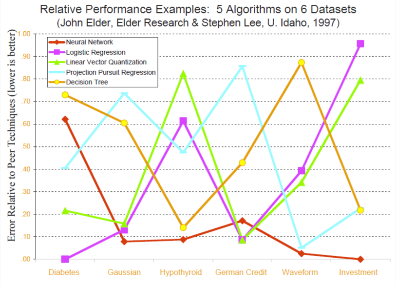

## *“Bagging predictors is a method for generating multiple versions of a predictor and using these to get an aggregated predictor.”* (Breiman 1996)[^1]

해당 포스트는 Ensemble 학습의 대표적인 방법 중의 하나인 Bagging에 대해 소개하고 있습니다. 포스트의 내용은 주로 고려대학교 강필성 교수님의 Business Analytics 강의 내용 및 강의 슬라이드와 [Machine Learning Mastery](https://machinelearningmastery.com/bagging-and-random-forest-ensemble-algorithms-for-machine-learning/)라는 블로그 내용을 바탕으로 작성되었습니다. 이외에도 다른 곳에서 참고한 부분은 주석으로 정리해두었습니다. 

<hr>

### 1. Why Bagging? 

여러 Classificaiton 알고리즘 중에서도 Decision Tree는 그 결과를 이해하기 쉽다는 측면 때문에 기계학습을 전공하는 사람들 뿐만 아니라 비전공자들도 애용하는 알고리즘입니다. 그러나 이러한 유용성에도 불구하고 Decision Tree는 한 가지 큰 단점을 가지고 있습니다. 그것은 다른 경쟁 알고리즘 (예. 로지스틱 회귀 분석, LDA)에 비해서 분산값이 높게 나옵니다. 

분산값이 높게 나온다는 것은 쉽게 말하자면, **학습 모델의 input 데이터의 값이 살짝 달라져도 Tree가 매우 다른 모양으로** 만들어지고 이에 따라서 결과적으로 매우 다른 분류 기준이 만들어진다는 뜻입니다. 다른 말로 표현하자면 Decision Tree는 overfitting의 문제가 늘 존재한다고 말할 수 있겠습니다. 

**Bagging 알고리즘**은 Decision Tree처럼 모델의 bias는 낮지만 variance가 높은 분류 알고리즘들의 **variance를 낮추는 방법**입니다. 뒤에서 좀더 구체적으로 설명하겠지만 간단하게 말하면, Bootstrap이라는 방법을 통해서 여러 개의 sample을 만들고, 각각의 sample을 이용해서 학습한 결과를 결합시키는 방법입니다. (그래서 **B**oostrap + **Agg**regat**ing** = Bagging입니다.)

본격적으로 Bagging 알고리즘에 대해서 살펴보기 전에 우선 Ensemble 학습에 대해서 살펴보고 Bagging 알고리즘을 통해서 얻을 수 있는 효과가 무엇인지 한번 더 짚어보도록 하겠습니다. 

### 2. Ensemble Learning
#### ***Why Ensemble?***

장님 코끼리 만지기라는 우화를 모두들 들어보셨을 겁니다. 각자 자기가 본 것이 전부라고 주장하는 우매함을 꾸짖는 교훈적인 우화인데, 이를 반대로 적용하면 이렇게 말할 수도 있을 겁니다.

> 수많은 장님들이 각각 만진 것들을 모두 합치면 코끼리에 매우 가까운 모양을 추론할 수 있다.

Ensemble 학습은 이 명제와 매우 비슷한 intuition을 가지고 있습니다. 그것을 다음의 명제로 정리할 수 있습니다.

> 하나의 알고리즘만 이용하는 것보다, 여러 개의 알고리즘의 결과를 종합할 때 더 나은 Performance를 얻을 수 있다.

아래의 이미지를 보면서 왜 Ensemble 학습을 하는 것인지에 대한 이유를 생각해보겠습니다.

강필성 교수님의 강의 슬라이드에서 발췌한 이 그래프는 5개의 서로 다른 알고리즘을 6개의 데이터셋에 적용했을 때, 그 performance가 어떻게 되는 지를 보여주고 있습니다. 그래프의 모양을 보시면 모든 데이터셋에서 우월한 performance를 보이는 알고리즘은 존재하지 않는다는 것을 확인할 수 있습니다. 이는 연구자나 현업에 계신 분들에게 다음과 같은 질문을 던져줍니다. 

> 내가 가진 데이터셋에는 어떤 알고리즘이 최적의 알고리즘일까?

하지만 나의 데이터셋에 맞는 알고리즘을 찾기 위해서 일일이 trial & error를 해보는 것은 굉장히 부담스러운 일일 겁니다.

이러한 고민에 대한 대답은 다음의 그래프를 통해서 확인할 수 있습니다.

위 이미지에서 각각의 그래프는 5개의 알고리즘의 결과를 결합하였을 때(Ensemble 학습)의 결과를 보여주고 있습니다. 어떻게 결합했느냐에 따라서 약간의 차이는 존재할 수 있지만, 한 가지 확실한 것은 4가지 결합 방식의 결과 모두가 개별적인 알고리즘으로 학습했을 때보다 더 좋은 performance를 보였는 사실입니다. 이를 통해서 우리는 경험적으로 Ensemble 학습을 했을 때 개별 알고리즘 보다 더 좋은 performance를 낼 수 있다는 것을 확인할 수 있습니다. 따라서 위의 질문에 대해서는 다음과 같은 답을 내릴 수 있습니다. 

> 일단은, Ensemble!

#### ***Then, why does Ensemble work well?***


### 3. Issues in Bagging

본격적으로 Bagging에 대해서 논하기 전에, 먼저 Leon Breiman 교수님이 본인의 1996년 Machine Learning 저널에서 쓴 Bagging에 대한 정의(제가 이 포스트 맨 위에 쓴 영어 문장)를 살펴보겠습니다.

> ***"Bagging은 여러 버전의 예측기(predictor)를 생성하고 이 예측기들을 결합한 예측기(an aggregated predictor)를 이용하기 위한 방법이다."***

이 정의를 살펴보는 이유는 이 정의가 Bagging과 관련된 중요한 이슈 2가지를 잘 담고 있기 때문입니다. 그 이슈들을 다음과 같습니다.

1. Ensemble 시스템의 개별 구성요소인 base classifier의 다양성을 어떻게 확보할까? (어떻게 ***다양한*** 예측기를 생성할 것인가?)
1. 개별 분류기의 결과물을 어떻게 통합할 것인가? (이 예측기들을 ***어떻게 결합***할 것인가?)

이를 그림으로 표현하자면 다음과 같이 표현할 수 있을 것입니다.

위 그림에서 윗 부분에 있는 빨간 점선 안의 부분은 첫번째 이슈인 base classifier의 다양성 확보의 문제를 담고 있습니다. 만약, 각각의 Subset 간의 correlation이 크다면 다양성을 확보할 수가 없을 것입니다. 따라서 Subset의 개별성을 확보할 수 있는 systematic sampling method가 매우 중요하다고 할 수 있습니다. Bootstrap이라는 samping 방법을 사용하기 전, 가능 단순한  방법은 "*K-fold data split*"이었습니다. 이 방법에 대해서는 아래에서 설명하도록 하겠습니다.

아랫 부분의 빨간 점선 안의 부분은 두번째 이슈인 결과물의 통합에 대한 문제를 담고 있습니다. 이 결합 방법은 단순한 평균부터, 가중 평균 등 다양한 방법이 존재합니다. 

두 개의 빨간 점선 박스 가운데에 위치한 model 부분에는 어떤 supervied learning algorithm이라도 사용할 수 있기 때문에 따로 특별한 표시를 해두지는 않았습니다. 다만 여기서 주의할 점은 bagging을 통해서 performance를 높이기 위해서는 Logistic regression, LDA과 같이 Bias가 큰 알고리즘 보다는 Decision Tree, SVM과 같이 Bias는 낮고 Variance가 큰 알고리즘을 사용하여야 합니다.

### 4. K-fold Data Split

K-fold data split은 전체 Dataset을 k개의 블록으로 나눈 다음에, 각각의 base classifier에서는 "k-1"개의 subset만을 학습하는 방법을 일컫습니다. 아래 이미지를 통해 K-fold data split이 어떻게 이루어지는 지를 한번 더 확인해 보겠습니다.


K-fold data split은 우선 전체 Dataset을 랜덤으로 K개의 블록으로 나누는 것부터 시작합니다. 위 다이어그램에서 X(n)은 K개의 블록 중 n번째 블록의 독립변수를 뜻하고 y(n)은 n번째 블록의 종속변수를 뜻합니다. 이렇게 K개로 나눈 블록을 각각 "K-1"개씩 학습을 하게 됩니다.

다이어그램의 오른편의 가장 위를 보면 f1 학습기가 있습니다. 이 f1 학습기는 'K'번째 블록을 제외한 "K-1"개의 블록에 대해서 학습을 진행합니다. f2 학습기는 'K-1'번째 블록을 제외한 "K-1"개의 블록에 대해서 학습을 진행합니다. 같은 방식으로 f3 학습기는 'K-2'번째 블록을 제외한 "K-1"개의 블록에 대해서 학습을 진행합니다. 이런 방식으로 학습을 진행하면 총 "K"개의 학습기에 대해서 학습이 진행되게 됩니다.

이런 학습 방식에서 f1 학습기와 f2 학습기는 "K-2"개의 블록을 공유하게 됩니다. f2 학습기와 f3 학습기 또한 "K-2"의 블록을 공유합니다. 이처럼 개별 base classifier 간의 높은 상관관계 때문에, K-fold data split의 방법으로는 충분한 **다양성**을 확보하는 데에 제약이 존재합니다.

### 5. Bootstraping Aggregation (Bagging)

그렇다면, 우리의 논의에 중심에 있는 Bagging은 어떻게 **다양성**을 확보할 수 있을까요. 그 해답은 Bootstrap이라는 샘플링 방식으로부터 옵니다.

#### ***Bootstrap Method***

Bootstrapping은 중복을 허용한 샘플링으로부터 얻어낸 테스트값이나 통계량을 지칭합니다. 기계학습의 맥락에서는 중복을 허용하는 랜덤 샘플링을 통해서 데이터셋의 사이즈를 늘리는 방법을 가리켜 Bootstrapping이라고 합니다. 

Bootstrapping은 데이터셋(training set) 내의 데이터 분포가 고르지 않은 경우에 사용됩니다. 사과와 오렌지를 구분하는 classifier를 트레이닝한다고 가정해보겠습니다. Training set에 사과 이미지 1만장과 오렌지 이미지 100장이 포함되어 있다면, 항상 사과만 찍는 멍청한 classifier도 99%의 트레이닝 정확도를 보일 것입니다. 이렇게 균형이 맞지 않은 상황에서는 데이터가 적은 클래스의 error는 무시되는 방향으로 트레이닝되기 쉽습니다. Bootstrapping을 이용하면 중복을 허용해서 랜덤 샘플링을 하기 때문에 원래 데이터셋이 가지고 있었던 불균형을 해소하는 데에 도움을 줄 수 있습니다.[^2]

다른 예를 통해서 Bootstrap이 실제로 어떻게 진행되는 지 확인해보겠습니다. 우리에게 1000개의 숫자값이 있는 모집단에서 100개의 숫자값(X라고 하겠습니다)이 들어있는 샘플을 뽑았다고 가정해보겠습니다. 그리고 이 숫자들을 이용해서 모집단의 평균을 구하고자 합니다. <br>
물론 모집단의 평균을 다음과 같은 식으로 계산할 수도 있습니다:

mean(x) = 1/100 * sum(x)

그러나 조금만 생각해봐도 이 방식의 연산은 샘플이 가지고 있는 오류를 그대로 담고 있다는 것을 알고 있습니다. Bootstrap을 이용하면 다음과 같은 방식으로 모집단의 평균을 연산하게 됩니다:

1. 가지고 있는 샘플 중, 중복을 허용하여서 많은 숫자의 sub-sample(예. 1000개의 sub-sample)을 추출합니다.
1. 각 sub-sample의 평균값을 계산합니다.
1. sum-sample의 평균값들의 평균을 계산합니다. 그리고 이 평균값이 모집단 평균의 추정치가 됩니다.

#### ***Bootstrapping for Bagging***
Bagging 알고리즘을 적용하기 위한 Bootstrapping은 다음과 같이 이루어집니다.


Bootstrapping에서 핵심은 Bootstrap이라는 Orignal Dataset에서 뽑은 샘플을 만드는 데에 있습니다. 만일 Original Data에 N개의 관찰값이 존재한다면, 그 N개의 관찰값 중 중복을 허용하여서 다시 N개의 값을 뽑아서 하나의 Bootstrap을 만듭니다. 위의 이미지를 보면, Original Dataset에 10개의 관찰값이 존재합니다. 중복을 허용하여서 랜덤 샘플링을 하면 Bootstrap 1, Bootstrap 2, ... , Bootstrap B (총 B개의 Bootstrap을 만든다고 가정할 때)을 만들 수 있습니다. 그리고 각각의 Bootstrap에는 Original Dataset과는 다르게 같은 관찰값이 여러 번 나온다는 것을 확인할 수 있습니다.

#### ***Result Aggregating***

앞에서 설명한 대로 B개의 Bootstrap을 만들고 나면, Model complexity가 높은(Low Bias & High Variance) base classifier를 통해 학습을 하게 됩니다. 그 이후에는 base classifier를 통해서 학습한 결과를 어떻게 결합할 것인지의 문제가 남아 있습니다. 

결과값을 결합하는 방법에는 여러 가지가 있지만 여기에서는 대표적인 3가지의 결합 방법을 설명하도록 하겠습니다.

##### 1. Majority Voting

##### 1. Weighted Voting (weight: training accuracy of individual models)

##### 1. Majority Voting (weight: predicted probability of each class)
<hr>
### Bagging in Marketing Research


<hr>
### Bagging using Python Code


이거 한글도 되는 건가? 한글 안 되면 안 되는데.... Good clean read is set up with readability first in mind. Whatever you want to communicate here can be read easily, and without distraction. Of course, it's fully responsive, which means people can read it naturally on any phone, or tablet. Write it in markdown in <code>index.md</code> and get a beautifully published piece.

Lorem ipsum dolor sit amet, consectetur adipiscing elit, sed do eiusmod tempor incididunt ut labore et dolore magna aliqua. Ut enim ad minim veniam, quis nostrud exercitation ullamco laboris nisi ut aliquip ex ea commodo consequat. Duis aute irure dolor in reprehenderit in voluptate velit esse cillum dolore eu fugiat nulla pariatur. Excepteur sint occaecat cupidatat non proident, sunt in culpa qui officia deserunt mollit anim id est laborum.

> "Lorem ipsum dolor sit amet, consectetur adipiscing elit, sed do eiusmod tempor incididunt ut labore et dolore magna aliqua. Ut enim ad minim veniam, quis nostrud exercitation ullamco laboris nisi ut aliquip ex ea commodo consequat.

### With footnotes too!

Back up your stuff with solid, clean citations. Footnotes can be written in markdown and appear like this. Use as many as you like.

Lorem ipsum dolor sit amet, consectetur adipiscing elit, sed do eiusmod tempor incididunt ut labore et dolore magna aliqua. Ut enim ad minim veniam, quis nostrud exercitation ullamco laboris nisi ut aliquip ex ea commodo consequat.

### Add social sharing buttons

Simply add the following line anywhere in your markdown:

<pre><code>


</code></pre>

and get a nice responsive sharing ribbon.



Add this at the bottom, or the top, or between every other paragraph if you're desprate for social validation.

Just remember to customize the buttons to fit your url in the `_includes/sharing.html` file. These buttons are made available and customizable by the good folks at kni-labs. See the documentation at [https://github.com/kni-labs/rrssb](https://github.com/kni-labs/rrssb) for more information.

### Font awesome is also included

<i class="fa fa-quote-left fa-3x fa-pull-left fa-border"></i> Now you can use all the cool icons you want! [Font Awesome](http://fontawesome.io) is indeed awesome. But wait, you don't need this sweetness and you don't want that little bit of load time from the font awesome css? No problem, just disable it in the `config.yml` file, and it won't be loaded.

<ul class="fa-ul">
  <li><i class="fa-li fa fa-check-square"></i>you can make lists...</li>
  <li><i class="fa-li fa fa-check-square-o"></i>with cool icons like this,</li>
  <li><i class="fa-li fa fa-spinner fa-spin"></i>even ones that move!</li>
</ul>

If you need them, you can stick any of the [605 icons](http://fontawesome.io/icons/) anywhere, with any size you like. ([See documentation](http://fontawesome.io/examples/))

<i class="fa fa-building"></i>&nbsp;&nbsp;<i class="fa fa-bus fa-lg"></i>&nbsp;&nbsp;<i class="fa fa-cube fa-2x"></i>&nbsp;&nbsp;<i class="fa fa-paper-plane fa-3x"></i>&nbsp;&nbsp;<i class="fa fa-camera-retro fa-4x">

### Add images to make your point

Images play nicely with this template as well. Add diagrams or charts to make your point, and the template will fit them in appropriately.


Lorem ipsum dolor sit amet, consectetur adipiscing elit, sed do eiusmod tempor incididunt ut labore et dolore magna aliqua. Ut enim ad minim veniam, quis nostrud exercitation ullamco laboris nisi ut aliquip ex ea commodo consequat. Duis aute irure dolor in reprehenderit in voluptate velit esse cillum dolore eu fugiat nulla pariatur. Excepteur sint occaecat cupidatat non proident, sunt in culpa qui officia deserunt mollit anim id est laborum.

Thanks to [Shu Uesengi](https://github.com/chibicode) for inspiring and providing the base for this template with his excellent work, [solo](https://github.com/chibicode).

## Image


## Header

# Head 1
## Head 2
### Head 3
#### Head 4
##### Head 5
###### Head 6


## Lists

Unordered list

*   I am the first unordered list item
*   I am the second unordered list item
*   I am the third unordered list item


Ordered list

1.  I am the first ordered list item
1.  I am the second ordered list item
1.  I contain an `inline code`


## Code block

```python
def func(x):
    print('hello, world')
    print('this is a really long statements, this is a really long statementsi, this is a really long statements')
```

## Inline code

Ut enim ad minima veniam, `quis` nostrum exercitationem ullam corporis suscipit laboriosam, nisi ut aliquid ex ea commodi consequatur? Quis autem vel eum iure reprehenderit qui in ea voluptate velit esse quam nihil molestiae consequatur, `vel` illum qui dolorem eum `fugiat` quo voluptas nulla pariatur?


## Blockquote

> Sed ut perspiciatis unde omnis iste natus error sit voluptatem accusantium doloremque laudantium, totam rem aperiam, eaque ipsa quae ab illo inventore veritatis et quasi architecto beatae vitae


## Paragraph

Nam eget dui. Etiam rhoncus. Maecenas tempus, tellus eget condimentum rhoncus, sem quam semper libero, sit amet adipiscing sem neque sed ipsum. Nam quam nunc, blandit vel, luctus pulvinar, hendrerit id, lorem. Maecenas nec odio et ante tincidunt tempus. Donec vitae sapien ut libero venenatis faucibus. Nullam quis ante. Etiam sit amet orci eget eros faucibus tincidunt. Duis leo.

<hr>

##### Footnotes:

[^1]: Breiman, Leo (1996). "Bagging predictors". Machine Learning. 24 (2): 123–140.

[^2]: [Learning Carrot 블로그](https://learningcarrot.wordpress.com/2015/11/12/%EB%B6%80%ED%8A%B8%EC%8A%A4%ED%8A%B8%EB%9E%A9%EC%97%90-%EB%8C%80%ED%95%98%EC%97%AC-bootstrapping/)

This post shows all customized elements.
Sed ut perspiciatis unde omnis iste natus error sit voluptatem accusantium doloremque laudantium, totam rem aperiam, eaque ipsa quae ab illo inventore veritatis et quasi architecto beatae vitae dicta sunt explicabo.


