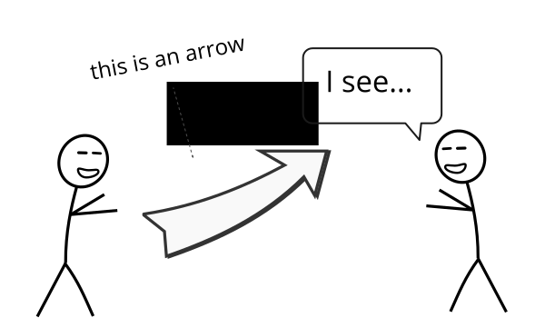

## *“Bagging predictors is a method for generating multiple versions of a predictor and using these to get an aggregated predictor.”* (Breiman 1996)

해당 포스트는 Ensemble 학습의 대표적인 방법 중의 하나인 Bagging에 대해 소개하고 있습니다. 포스트의 내용은 주로 고려대학교 강필성 교수님의 Business Analytics 강의 내용 및 강의 슬라이드와, 처음 Bagging이라는 알고리즘을 소개한 Leo Breiman 교수님이 Machine Learning 저널에 1996년에 퍼블리시한 논문을 바탕으로 작성되었습니다. 이외에도 다른 곳에서 참고한 부분은 주석으로 정리해두었습니다. 

<hr>

### 1. Why Bagging? 

여러 Classificaiton 알고리즘 중에서도 Decision Tree는 그 결과를 이해하기 쉽다는 측면 때문에 기계학습을 전공하는 사람들 뿐만 아니라 비전공자들도 애용하는 알고리즘입니다. 그러나 이러한 유용성에도 불구하고 Decision Tree는 한 가지 큰 단점을 가지고 있습니다. 그것은 다른 경쟁 알고리즘 (예. 로지스틱 회귀 분석, k-NN)에 비해서 분산값이 높게 나옵니다. 

분산값이 높게 나온다는 것은 쉽게 말하자면, **학습 모델의 input 데이터의 값이 살짝 달라져도 Tree가 매우 다른 모양으로** 만들어지고 이에 따라서 결과적으로 매우 다른 분류 기준이 만들어진다는 뜻입니다. 다른 말로 표현하자면 Decision Tree는 overfitting의 문제가 늘 존재한다고 말할 수 있겠습니다. 

**Bagging 알고리즘**은 Decision Tree처럼 모델의 bias는 낮지만 variance가 높은 분류 알고리즘들의 **variance를 낮추는 방법**입니다. 뒤에서 좀더 구체적으로 설명하겠지만 간단하게 말하면, Bootstrap이라는 방법을 통해서 여러 개의 sample을 만들고, 각각의 sample을 이용해서 학습한 결과를 결합시키는 방법입니다. (그래서 **B**oostrap + **Agg**regat**ing** = Bagging입니다.)

본격적으로 Bagging 알고리즘에 대해서 살펴보기 전에 우선 Ensemble 학습에 대해서 살펴보고 Bagging 알고리즘을 통해서 얻을 수 있는 효과가 무엇인지 한번 더 짚어보도록 하겠습니다. 

### 2. Ensemble Learning
#### ***Why Ensemble?***

장님 코끼리 만지기라는 우화를 모두들 들어보셨을 겁니다. 각자 자기가 본 것이 전부라고 주장하는 우매함을 꾸짖는 교훈적인 우화인데, 이를 반대로 적용하면 이렇게 말할 수도 있을 겁니다.

> 수많은 장님들이 각각 만진 것들을 모두 합치면 코끼리에 매우 가까운 모양을 추론할 수 있다.

Ensemble 학습은 이 명제와 매우 비슷한 intuition을 가지고 있습니다. 그것을 다음의 명제로 정리할 수 있습니다.

> 하나의 알고리즘만 이용하는 것보다, 여러 개의 알고리즘의 결과를 종합할 때 더 나은 Performance를 얻을 수 있다.

아래의 이미지를 보면서 왜 Ensemble 학습을 하는 것인지에 대한 이유를 생각해보겠습니다.

강필성 교수님의 강의 슬라이드에서 발췌한 이 그래프는 5개의 서로 다른 알고리즘을 6개의 데이터셋에 적용했을 때, 그 performance가 어떻게 되는 지를 보여주고 있습니다. 그래프의 모양을 보시면 모든 데이터셋에서 우월한 performance를 보이는 알고리즘은 존재하지 않는다는 것을 확인할 수 있습니다. 이는 연구자나 현업에 계신 분들에게 다음과 같은 질문을 던져줍니다. 

> 내가 가진 데이터셋에는 어떤 알고리즘이 최적의 알고리즘일까?

하지만 나의 데이터셋에 맞는 알고리즘을 찾기 위해서 일일이 trial & error를 해보는 것은 굉장히 부담스러운 일일 겁니다.

이러한 고민에 대한 대답은 다음의 그래프를 통해서 확인할 수 있습니다.

위 이미지에서 각각의 그래프는 5개의 알고리즘의 결과를 결합하였을 때(Ensemble 학습)의 결과를 보여주고 있습니다. 어떻게 결합했느냐에 따라서 약간의 차이는 존재할 수 있지만, 한 가지 확실한 것은 4가지 결합 방식의 결과 모두가 개별적인 알고리즘으로 학습했을 때보다 더 좋은 performance를 보였는 사실입니다. 이를 통해서 우리는 경험적으로 Ensemble 학습을 했을 때 개별 알고리즘 보다 더 좋은 performance를 낼 수 있다는 것을 확인할 수 있습니다. 따라서 위의 질문에 대해서는 다음과 같은 답을 내릴 수 있습니다. 

> 일단은, Ensemble!

#### ***Then, why does Ensemble work well?***


### 3. Sampling without Replacement

본격적으로 Bagging에 대해서 논하기 전에, 먼저 Leon Breiman 교수님이 본인의 1996년 Machine Learning 저널에서 쓴 Bagging에 대한 정의(제가 이 포스트 맨 위에 쓴 영어 문장)를 살펴보겠습니다.

> ***"Bagging은 여러 버전의 예측기(predictor)를 생성하고 이 예측기들을 결합한 예측기(an aggregated predictor)를 이용하기 위한 방법이다."***

이 정의를 살펴보는 이유는 이 정의가 Bagging과 관련된 중요한 이슈 2가지를 잘 담고 있기 때문입니다. 그 이슈들을 다음과 같습니다.

1. 어떻게 ***다양한*** 예측기를 생성할 것인가?
1. 이 예측기들을 ***어떻게 결합***할 것인가?


### 4. Bootstraping Aggregation

<hr>
### Bagging in Marketing Research


<hr>
### Bagging using Python Code


이거 한글도 되는 건가? 한글 안 되면 안 되는데.... Good clean read is set up with readability first in mind. Whatever you want to communicate here can be read easily, and without distraction. Of course, it's fully responsive, which means people can read it naturally on any phone, or tablet. Write it in markdown in <code>index.md</code> and get a beautifully published piece.

Lorem ipsum dolor sit amet, consectetur adipiscing elit, sed do eiusmod tempor incididunt ut labore et dolore magna aliqua. Ut enim ad minim veniam, quis nostrud exercitation ullamco laboris nisi ut aliquip ex ea commodo consequat. Duis aute irure dolor in reprehenderit in voluptate velit esse cillum dolore eu fugiat nulla pariatur. Excepteur sint occaecat cupidatat non proident, sunt in culpa qui officia deserunt mollit anim id est laborum.

> "Lorem ipsum dolor sit amet, consectetur adipiscing elit, sed do eiusmod tempor incididunt ut labore et dolore magna aliqua. Ut enim ad minim veniam, quis nostrud exercitation ullamco laboris nisi ut aliquip ex ea commodo consequat.

### With footnotes too!

Back up your stuff with solid, clean citations. Footnotes can be written in markdown and appear like this.[^1] Use as many as you like.[^2]

Lorem ipsum dolor sit amet, consectetur adipiscing elit, sed do eiusmod tempor incididunt ut labore et dolore magna aliqua. Ut enim ad minim veniam, quis nostrud exercitation ullamco laboris nisi ut aliquip ex ea commodo consequat.

### Add social sharing buttons

Simply add the following line anywhere in your markdown:

<pre><code>


</code></pre>

and get a nice responsive sharing ribbon.



Add this at the bottom, or the top, or between every other paragraph if you're desprate for social validation.

Just remember to customize the buttons to fit your url in the `_includes/sharing.html` file. These buttons are made available and customizable by the good folks at kni-labs. See the documentation at [https://github.com/kni-labs/rrssb](https://github.com/kni-labs/rrssb) for more information.

### Font awesome is also included

<i class="fa fa-quote-left fa-3x fa-pull-left fa-border"></i> Now you can use all the cool icons you want! [Font Awesome](http://fontawesome.io) is indeed awesome. But wait, you don't need this sweetness and you don't want that little bit of load time from the font awesome css? No problem, just disable it in the `config.yml` file, and it won't be loaded.

<ul class="fa-ul">
  <li><i class="fa-li fa fa-check-square"></i>you can make lists...</li>
  <li><i class="fa-li fa fa-check-square-o"></i>with cool icons like this,</li>
  <li><i class="fa-li fa fa-spinner fa-spin"></i>even ones that move!</li>
</ul>

If you need them, you can stick any of the [605 icons](http://fontawesome.io/icons/) anywhere, with any size you like. ([See documentation](http://fontawesome.io/examples/))

<i class="fa fa-building"></i>&nbsp;&nbsp;<i class="fa fa-bus fa-lg"></i>&nbsp;&nbsp;<i class="fa fa-cube fa-2x"></i>&nbsp;&nbsp;<i class="fa fa-paper-plane fa-3x"></i>&nbsp;&nbsp;<i class="fa fa-camera-retro fa-4x">

### Add images to make your point

Images play nicely with this template as well. Add diagrams or charts to make your point, and the template will fit them in appropriately.



Lorem ipsum dolor sit amet, consectetur adipiscing elit, sed do eiusmod tempor incididunt ut labore et dolore magna aliqua. Ut enim ad minim veniam, quis nostrud exercitation ullamco laboris nisi ut aliquip ex ea commodo consequat. Duis aute irure dolor in reprehenderit in voluptate velit esse cillum dolore eu fugiat nulla pariatur. Excepteur sint occaecat cupidatat non proident, sunt in culpa qui officia deserunt mollit anim id est laborum.

Thanks to [Shu Uesengi](https://github.com/chibicode) for inspiring and providing the base for this template with his excellent work, [solo](https://github.com/chibicode).

<hr>

##### Footnotes:

[^1]: This is a footnote. Click to return.

[^2]: Here is another.

This post shows all customized elements.
Sed ut perspiciatis unde omnis iste natus error sit voluptatem accusantium doloremque laudantium, totam rem aperiam, eaque ipsa quae ab illo inventore veritatis et quasi architecto beatae vitae dicta sunt explicabo.


## Image


## Header

# Head 1
## Head 2
### Head 3
#### Head 4
##### Head 5
###### Head 6


## Lists

Unordered list

*   I am the first unordered list item
*   I am the second unordered list item
*   I am the third unordered list item


Ordered list

1.  I am the first ordered list item
1.  I am the second ordered list item
1.  I contain an `inline code`


## Code block

```python
def func(x):
    print('hello, world')
    print('this is a really long statements, this is a really long statementsi, this is a really long statements')
```

## Inline code

Ut enim ad minima veniam, `quis` nostrum exercitationem ullam corporis suscipit laboriosam, nisi ut aliquid ex ea commodi consequatur? Quis autem vel eum iure reprehenderit qui in ea voluptate velit esse quam nihil molestiae consequatur, `vel` illum qui dolorem eum `fugiat` quo voluptas nulla pariatur?


## Blockquote

> Sed ut perspiciatis unde omnis iste natus error sit voluptatem accusantium doloremque laudantium, totam rem aperiam, eaque ipsa quae ab illo inventore veritatis et quasi architecto beatae vitae


## Paragraph

Nam eget dui. Etiam rhoncus. Maecenas tempus, tellus eget condimentum rhoncus, sem quam semper libero, sit amet adipiscing sem neque sed ipsum. Nam quam nunc, blandit vel, luctus pulvinar, hendrerit id, lorem. Maecenas nec odio et ante tincidunt tempus. Donec vitae sapien ut libero venenatis faucibus. Nullam quis ante. Etiam sit amet orci eget eros faucibus tincidunt. Duis leo.
